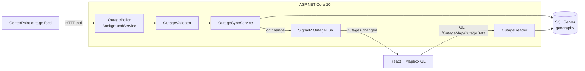

# Houston Outage Map

Live map of CenterPoint Energy power outages across the Houston metro. A .NET background service polls the utility's public feed, diffs each snapshot against SQL Server, and pushes a change signal over SignalR so every connected browser updates without refreshing.

[](https://dev.azure.com/raymondcal/outage-proj/_build/latest?definitionId=1&branchName=main)


## Stack

- **Backend** — ASP.NET Core 10
- **Data** — EF Core, SQL Server (spatial)
- **Real-time** — SignalR
- **Frontend** — React 19, TypeScript
- **Maps** — Mapbox GL

<!-- **Live demo:** URL here, or delete this line -->

<!-- Replace with a GIF: outages loading, a cluster expanding on zoom, a popup opening, the "Live" pill ticking. 10-15s, ~800px wide. -->
<!-- -->

---

## Why I built this

CenterPoint's own outage map is the only public view of where the power is out in Houston, and during a storm it's the page everyone in the city refreshes. I wanted to rebuild it end to end, from ingest through storage and push to rendering, because it forced me to solve problems a CRUD app never raises: a feed I don't control, geospatial data, and updates that have to reach browsers that are already connected.

The feed publishes a full snapshot of every active outage, so all of the work sits downstream of it. Turning a stream of snapshots into durable state, and turning state changes into something a map can render smoothly.

## Data source
 
CenterPoint Energy has no documented public API. They do have an unauthenticated, undocumented JSON endpoint that returns a full snapshot of currently active outages. This is the same endpoint that CenterPoint Energy's own <a href=https://tracker.centerpointenergy.com/map/> official outage map </a> uses. Nothing here bypasses authentication, scrapes rendered HTML, or touches non-public data.
 
Because it's a third party's undocumented endpoint, the project is deliberately conservative in its use.

## Features

- The server polls upstream once and connected clients get a SignalR signal and re-fetch, so the browser itself never polls.
- Outages are soft-deactivated with a `ResolvedAt` timestamp instead of deleted, so the table keeps a record of what happened rather than only a live view.
- Locations are stored as a SQL Server `geography` column via NetTopologySuite and served to the browser as GeoJSON.
- Points cluster by zoom level, size by customers affected, and color by outage status. New outages pulse once when they arrive.
- A summary panel shows total outages, customers affected, a status breakdown, and a 6-hour trend of outages started.
- A live/reconnecting/offline pill shows feed health and how long it's been since the last update.

## Architecture



`OutagePoller` acts on a `PeriodicTimer`, fetches an "outage snapshot" through the `IOutageSource` abstraction, validates it, and hands it to `OutageSyncService`. The Sync service compares the snapshot to the active rows in the database and produces an `OutageSyncResult` counting what was added, updated, and deactivated. If anything changed, it broadcasts `OutagesChanged` over SignalR. Clients respond by calling `GET /OutageMap/OutageData`, which `OutageReader` serves as a GeoJSON `FeatureCollection` that Mapbox consumes directly.

```
OutageMap.Server/
  Controllers/          OutageMapController, the single read endpoint
  Services/             OutageSyncService, OutageReader, OutageUpdater, OutageValidator
    BackgroundServices/ OutagePoller
  Infrastructure/Http/  IOutageSource + PollOutageSource (live) / FixtureOutageService (offline)
  Models/               OutageEntity, AppDbContext, EF configuration, GeoJSON projection
  Dtos/                 Feed DTOs and the DTO to entity mapper
  Hubs/                 OutageHub
  Migrations/
outagemap.client/src/
  map/                  Map component, Mapbox layer definitions, basemap config, interactions
  hooks/                useOutageFeed (fetch + SignalR), useOutageSelection
  lib/                  GeoJSON helpers, summary math, SignalR client, formatters
  components/           StatusPill, OutageStats, OutagePopup
OutageMap.Server.Tests/
  OutageServiceTests.cs HTTP-source unit tests against a mocked handler
  Integration/          Sync tests against real SQL Server via Testcontainers
```

## Design decisions

### One poller for many clients

Each browser could hit the utility feed on its own interval, but that scales upstream load with viewers and hammers a third party I don't own. The server polls instead, on a configurable interval (`OutageFeed:PollInterval`, default 10 minutes), and fans out over SignalR, so upstream load stays constant no matter how many people have the map open.

### The hub only signals

`OutagesChanged` carries no data. The client re-fetches the full collection when it hears the signal. Shipping deltas over the socket would mean the client maintains its own copy of server state and has to stay correct across reconnects and dropped messages. At roughly 100 concurrent outages the full re-fetch is cheap, and reconnect logic stays trivial: fetch again. This is the trade-off I'd revisit first if the dataset grew an order of magnitude.

### Snapshots get diffed, not replaced

The feed sends the current state of the world, so truncating the table and reloading it would work. It would also destroy history and churn the table. `OutageSyncService` loads active rows into a dictionary keyed by the upstream ID, adds what's new, updates what changed, and marks anything missing from the snapshot as resolved. `OutageUpdater` short-circuits when every field matches, so an unchanged snapshot writes nothing, and `SaveChangesAsync` only runs when something actually changed.

### Validate the whole snapshot before writing any of it

A malformed or empty response from upstream would otherwise read as "every outage in Houston just got resolved." `OutageValidator` rejects the snapshot wholesale if it's empty, has duplicate IDs, has invalid timestamps, or is missing a status, and the poll fails loudly in the log instead of corrupting state.

### A spatial column instead of two floats

`Location` is a `geography` `Point` (SRID 4326) rather than two doubles. It costs a NetTopologySuite dependency, but it keeps radius and bounding-box queries available later and lets the API emit standards-compliant GeoJSON without a hand-rolled serializer.

### Integration tests hit a real SQL Server

EF Core's in-memory provider doesn't model the `geography` type or enforce the unique index on `SourceId`, which are the two things most likely to break in this schema. Testcontainers spins up SQL Server in Docker, runs migrations against it, and each test is wrapped in a transaction that rolls back on dispose.

### The source sits behind an interface

`IOutageSource` has an HTTP implementation and a fixture implementation that reads a captured feed snapshot, so I can develop and demo the ingest pipeline without depending on the utility's endpoint being up.

## Getting started

### Prerequisites

- [.NET 10 SDK](https://dotnet.microsoft.com/download)
- Node.js 22+
- SQL Server. LocalDB (ships with Visual Studio) is the default, but any instance works
- Docker, only needed to run the integration tests
- A [Mapbox access token](https://account.mapbox.com/) (free tier)

### Configure

The connection string in `appsettings.json` points at LocalDB by default. To override it, or to point at another server, use user secrets rather than editing the tracked file:

```bash
cd OutageMap.Server
dotnet user-secrets set "ConnectionStrings:DefaultConnection" "Server=localhost;Database=OutageMapDb;Trusted_Connection=True;TrustServerCertificate=True"
```

The client needs a Mapbox token in `outagemap.client/.env.local` (gitignored):

```
VITE_MAPBOX_TOKEN=pk.your_token_here
```

### Create the database

```bash
cd OutageMap.Server
dotnet tool restore          # installs the pinned dotnet-ef from .config/dotnet-tools.json
dotnet ef database update
```

### Run

```bash
dotnet run --project OutageMap.Server
```

The server starts the Vite dev server automatically via `Microsoft.AspNetCore.SpaProxy`. The map is at `https://localhost:5173` and Swagger at `https://localhost:7142/swagger`.

The poller runs immediately on startup and then on the configured interval. Watch the console for `Poll #N. Added: … Updated: … Deactivated: …`.

### Test

```bash
dotnet test
```

Unit tests mock the HTTP handler and need nothing external. The integration tests pull `mcr.microsoft.com/mssql/server:2022` and need Docker running, so the first run takes a minute while the image downloads.

## API

| Method | Route                     | Returns                                              |
| ------ | ------------------------- | ---------------------------------------------------- |
| `GET`  | `/OutageMap/OutageData`   | GeoJSON `FeatureCollection` of all active outages     |
| `WS`   | `/outageHub`              | SignalR hub; emits `OutagesChanged` when state changes |

Each feature carries `id`, `startTime`, `etrTime`, `numPeople`, `status`, `cause`, `city`, `county`, `serviceArea`, and `zipCode` in its properties. The full schema is in Swagger when running in Development.

## Testing

| Suite | What it covers |
| ----- | -------------- |
| `OutageServiceTests` | HTTP source behavior: non-2xx responses throw, valid payloads deserialize |
| `OutageSyncServiceDbTests` | The sync diff against real SQL Server. New outages insert, changed fields update, outages missing from a snapshot deactivate, and an identical snapshot writes nothing |

## CI

`azure-pipelines.yml` runs on every push to `main`: restore, build both projects, `npm ci`, ESLint, Vite production build, then `dotnet test`.

## Known limitations

- The read endpoint is unfiltered, so every client fetches all active outages. Fine at Houston's typical volume of a few hundred; a bounding-box or status filter would be the first change if that grew.
- A failed poll only retries on the next tick. There's no backoff or jitter, and a sustained upstream outage just logs errors until it recovers.
- There's no caching layer, so every `OutagesChanged` sends N clients to the database at once. A short-lived cache on the GeoJSON projection is the obvious fix.
- Nothing is deployed. CI builds and tests but doesn't ship anywhere.
- Clustering happens in Mapbox in the browser, so the whole collection ships to every client regardless of viewport.
- No auth. All the data here is public, so there's nothing to protect, but there's also no rate limiting on the API.

## Future Additions

* Expose the outage history that's already being recorded
* Deploy to Azure App Service (maybe) with a GitHub Actions workflow.
* Implement more extensive logging/observability so the application can be changed quickly in response to external API changes
* Flesh out the furnishing and swapping of different outage sources in-application
* Cache the GeoJSON projection and invalidate it on sync.
* Add exponential backoff to the poller.

## License

MIT
